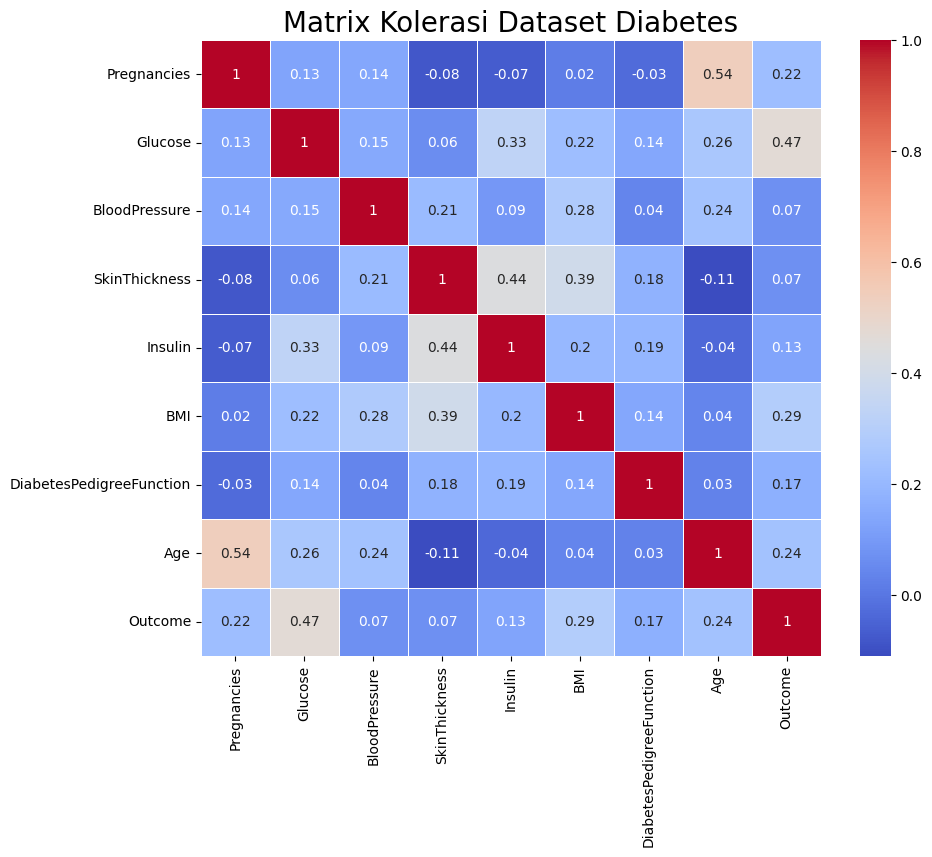

# Laporan

# Judul: Diabetes Disease Prediction

Oleh: Jidan Fikri

# Domain Proyek

Diabetes merupakan salah satu jenis penyakit yang sangat banyak diderita oleh manusia di seluruh dunia.  Menurut artikel dari  Kementrian Kesehatan Republik Indonesia, data dari International Diabites Federation (IDF) menunjukan Indonesia merupakan negara dengan peringkat kelima negara dengan jumlah diabetes terbanyak dengan total 19,5 juga penderita di tahun 2021 dan akan diproyeksikan untuk terus meningkat hingga tahun 2045 sebanyak 28,6 juta penderita. 

Selain mematikan, penyakit diabetes ini termasuk salah satu jenis penyakit yang sulit disadari dan dideteksi pada fase - fase awal kemunculannya. Pada artikel yang sama, Direktur Pencegahan dan Pengendalian Penyakit Tidak Menular Kementrian Kesehatan, Dr. Eva Susanti, S. Kp., M. Kes., mengatakan bahwa risiko seseorang untuk terjangkit penyakit ini dipengaruhi oleh beberapa faktor, beberapa diantaranya yaitu riwayat keluarga yang memiliki penyakit diabetes, kebiasaan konsumsi gula pada makanan ataupun minuman, dan kurangnya berolahraga.

Diabetes bukanlah penyakit yang baru, sebagai penyakit yang sudah ada sejak ratusan tahun silam, sudah banyak penelitian yang membahas tentang penyakit ini. Salah satunya yaitu penelitian yang dilakukan oleh Jack W. Smith et all., pada tahun 1988 dengan judul “Using the ADAP Learning Algorithm to Forecast the Onset of Diabetes Mellitus”. Sesuai judul dari penelitian tersebut, algoritma yang dinamakan ADAP algorithm yang digunakan untuk dapat melakukan melakukan diagnosa prediktif apakah seseorang mengidap diabetes atau tidak. Selain algoritma yang dihasilkan, penelitian ini juga menghasilkan dataset yang sampai sekarang masih sangat populer digunakan yaitu Pima Indian Diabetes Dataset yang berisi data kasus pasien di daerah Phoenix, Arizona, Amerika Serikat pada masa tersebut.

Dengan data yang semakin banyak dan teknologi komputasi yang semakin canggih, penyakit ini sudah seharusnya dapat dideteksi sedini mungkin dengan tingkat akurasi yang memungkinkan untuk dapat melakukan penanganan sesegera mungkin dan mengurangi angka kematian akibat penyakit diabetes. 

Referensi riset dan artikel:

 [https://sehatnegeriku.kemkes.go.id/baca/blog/20240110/5344736/saatnya-mengatur-si-manis/#:~:text=Menurut IDF%2C Indonesia menduduki peringkat,merupakan ibu dari segala penyakit](https://sehatnegeriku.kemkes.go.id/baca/blog/20240110/5344736/saatnya-mengatur-si-manis/#:~:text=Menurut%20IDF%2C%20Indonesia%20menduduki%20peringkat,merupakan%20ibu%20dari%20segala%20penyakit).

Smith, J. W., Everhart, J. E., Dickson, W. C., Knowler, W. C., & Johannes, R. S. (1988). Using the ADAP Learning Algorithm to Forecast the Onset of Diabetes Mellitus. *Proceedings of the Annual Symposium on Computer Application in Medical Care*, 261–265.

# Business Understanding

## Problem Statement

1. Apa saja persiapan yang perlu dilakukan pada data sebelum dapat digunakan untuk pelatihan model machine learning?
2. Bagaimana proses evaluasi model machine learning dilakukan sampai pada akhirnya menemukan performa model yang optimal untuk memprediksi seseorang terkena penyakit diabetes?

## Goals

1. Melakukan preparasi data seperti membersihkan data dari bagian yang kosong, pemerataan distribusi, hingga melakukan analisis mendalam terkait korelasi dari setiap variabel independen terhadap variabel dependen atau variabel target (outcome) sehingga dihasilkan model yang relevan dan akurat.
2. Menggunakan 4 jenis nilai kebenaran diantaranya, Truth Positive (TP), Truth Negative (TN), False Positive (FP), dan False Negative (FN) untuk kemudian membandingkan nilai akurasi, precision, recall, dan f1 score dari algoritma model yang digunakan. 

## Solution Statements

Berdasarkan problem statement di atas, maka disimpulkan solusi yang dapat dilakukan untuk mencapai tujuan dari proyek ini, diantaranya yaitu: 

1. Tahapan preparasi data dilakukan dengan menerapkan beberapa metode, diantaranya:
    1. Membagi dataset menjadi data latih dan data testing dengan perbandingan 70:30 atau 70% data latih dan 30% data testing. 
    2. Mengatasi data kosong dengan melakukan imputasi menggunakan median dari variabel target.
    3. Mengatasi distribusi dari data pada tiap variabel yang tidak simetris dengan menggunakan fungsi natural logaritmik ($ln$). 
    4. Melakukan standarisasi data pada dataset untuk memudahkan model machine learning dalam mengolah dan memahami fitur pada dataset yang digunakan.
    5. Mengatasi imbalance antara label 0 (pasien dengan diagnosa tidak mengalami diabetes) dengan label 1(pasien dengan diagnosa mengalami diabetes) dengan melakukan transformasi data latih menggunakan ***Synthetic Minority Oversampling Technique*** (SMOTE).
2. Case pada proyek ini merupakan binary classification dimana output dari model ini nantinya hanya dua, yaitu label 0 (pasien dengan diagnosa tidak mengalami diabetes) dengan label 1(pasien dengan diagnosa mengalami diabetes). Untuk mencari model terbaik, dilakukan perbandingan berdasarkan akurasi yang dihasilkan dari beberapa model tersebut. Untuk case pada proyek ini, ditetapkan restriksi yaitu hanya menggunakan 3 jenis model yang umumnya digunakan pada data dengan jenis binary classification ini, adapun algoritma yang digunakan adalah sebagai berikut:
    1. Logistic Regression
    2. K Neighbors Classification
    3. Random Forest

# Data Understanding

Dataset yang digunakan pada proyek ini adalah data [**Pima Indians Diabetes Database](https://www.kaggle.com/datasets/uciml/pima-indians-diabetes-database/data)** yang diambil dari platform Kaggle. Terdapat 768 baris data yang merupakan hasil perekaman medis diagnosa pasien wanita berumur setidaknya 21 tahun yang berasal dari daerah Phoenix, Arizona, Amerika Serikat. Adapun variabel - variabel yang ada pada dataset ini adalah sebagai berikut:

1. `Pregnancies` = Merupakan kehamilan yang telah dialami oleh pasien
2. `Glucose` = Merupakan nilai konsentrasi glukosa berdasarkan *oral glucose tolerance test* yang dilakukan oleh pasien 
3. `BloodPressure` = Merupakan nilai diastolik tekanan darah pasien
4. `SkinThickness` = Merupakan nilai pengukuran tebal kulit pada trisep dengan melihat kelenturan otot trisep. Biasanya pengukuran ketebalan ini dilakukan untuk memperkirakan persentase lemak yang ada pada tubuh.
5. `Insulin` = Merupakan nilai kadar level insulin dalam tubuh pasien
6. `BMI` = Body Mass Index (BMI) atau indeks masa tubuh merupakan nilai yang dihasilkan berdasarkan rasio antara berat badan dan tinggi badan pasien
7. `DiabetesPedigreeFunction` = Merupakan fungsi yang nilainya berdasarkan riwayat penyakit yang dimiliki oleh realasi/keluarga pasien. Fungsi sintetis ini dibuat oleh [Jack W. Smith](https://pmc.ncbi.nlm.nih.gov/articles/PMC2245318/) dalam riset yang sama dengan terbitnya dataset ini.
8. `Age` = Merupakan umur pasien
9. `Outcome` = Merupakan kolom output dimana terdapat dua jenis output (binary) yaitu antara 0 dan 1.

Berikut ini merupakan deskripsi statistik dari variabel - variabel yang ada pada [**Pima Indians Diabetes Database](https://www.kaggle.com/datasets/uciml/pima-indians-diabetes-database/data):**

|  | **Pregnancies** | **Glucose** | **BloodPressure** | **SkinThickness** | **Insulin** | **BMI** | **DiabetesPedigreeFunction** | **Age** | **Outcome** |
| --- | --- | --- | --- | --- | --- | --- | --- | --- | --- |
| **count** | 768.000000 | 768.000000 | 768.000000 | 768.000000 | 768.000000 | 768.000000 | 768.000000 | 768.000000 | 768.000000 |
| **mean** | 3.845052 | 120.894531 | 69.105469 | 20.536458 | 79.799479 | 31.992578 | 0.471876 | 33.240885 | 0.348958 |
| **std** | 3.369578 | 31.972618 | 19.355807 | 15.952218 | 115.244002 | 7.884160 | 0.331329 | 11.760232 | 0.476951 |
| **min** | 0.000000 | 0.000000 | 0.000000 | 0.000000 | 0.000000 | 0.000000 | 0.078000 | 21.000000 | 0.000000 |
| **25%** | 1.000000 | 99.000000 | 62.000000 | 0.000000 | 0.000000 | 27.300000 | 0.243750 | 24.000000 | 0.000000 |
| **50%** | 3.000000 | 117.000000 | 72.000000 | 23.000000 | 30.500000 | 32.000000 | 0.372500 | 29.000000 | 0.000000 |
| **75%** | 6.000000 | 140.250000 | 80.000000 | 32.000000 | 127.250000 | 36.600000 | 0.626250 | 41.000000 | 1.000000 |
| **max** | 17.000000 | 199.000000 | 122.000000 | 99.000000 | 846.000000 | 67.100000 | 2.420000 | 81.000000 | 1.000000 |

Keterangan:

- count merupakan jumlah data (baris) yang ada pada dataset.
- mean merupakan nilai rata-rata (mean).
- std merupakan nilai standar deviasi.
- min merupakan nilai terkecil yang ada pada variabel data tersebut.
- 25%, 50%, and 75% merupakan kuartil (Q1, Q2, Q3) pada data.
- max merupakan nilai terbesar yang ada pada variabel data tersebut.

### Penanganan data bernilai 0

| Kolom | Jumlah nilai-0 |
| --- | --- |
| Pregnancies | 111 |
| Glucose | 5 |
| BloodPressure  | 35 |
| SkinThickness | 227 |
| Insulin | 374 |
| BMI | 11 |
| DiabetesPedigreeFunction | 0 |
| Age | 0 |

Pada tabel deskripsi statistik, terlihat bahwa ada beberapa variabel yang memiliki nilai minimal yaitu nol seperti pada variabel `Pregnancies`, `Glucose`, `BloodPressure`, `SkinThickness`, `Insulin`, dan `BMI`.  Diantara keenam variabel ini, ada 1 variabel yang bisa disingkirkan dari daftar kekhawatiran yaitu variabel `Pregnancies` karena meskipun semua responden dari dataset ini adalah wanita, seperti yang terlihat pada tabel diatas kalau rentang umur minimum-maksimum dari data ini adalah berkisar antara 21-81 tahun, sehingga ada kemungkinan kalau responden atau pasien tersebut memang belum pernah mengalami masa kehamilan. 

Adapun variabel `Glucose`, `BloodPressure`, `SkinThickness`, `Insulin`, dan `BMI` perlu dianalisa lebih lanjut karna dapat berpotensi sebagai anomali. Berhubung dataset yang digunakan merupakan dataset klinis, pertanyaan terhadap munculnya nilai 0 pada kelima variabel ini mengundang pertanyaan besar. Misalnya saja apabila tekanan darah atau `BloodPressure` dari pasien tersebut bernilai 0, maka bukankah berarti orang tersebut tidak hidup?

Kemungkinan lainnya yaitu ketika dilakukan pengukuran di lapangan, kelima variabel ini hanya dilakukan sampling saja pada beberapa pasien. Jika kemungkinan ini yang terjadi, maka bisa dipastikan dataset ini mengalami *data leakage* sehingga memperbesar kemungkinan model yang akan dibuat nantinya menjadi bias dan tidak layak untuk digunakan.

Untuk itu perlu dilihat korelasi antara variabel - variabel tersebut dengan variabel target (`Outcome`). Apabila variabel tersebut memiliki nilai korelasi yang rendah terhadap variabel target, maka kekhawatiran akan *data leakage* dapat diabaikan karna variabel tersebut tidak berkorelasi atau berpengaruh terhadap variabel target.

Berhubung jumlah kehadiran nilai nol pada variabel `SkinThickness`dan `Insulin` adalah yang paling signifikan dimana pada variabel `Insulin` itu sendiri hampir memakan setengah dari keseluruhan dataset yang ada, maka kedua variabel ini yang akan menjadi perhatian utama dalam analisa korelasi ini. Bisa terlihat bahwa korelasi antara variabel `SkinThickness` dan `Insulin` dengan variabel target memiliki nilai korelasi yang sangat rendah. Maka dari itu kekhawatiran akan data leakage terhadap 2 variabel tersebut dapat dikesampingkan. 

Meskipun memiliki nilai korelasi yang rendah, dalam hal klinis kehadiran dari semua variabel akan menjadi sangat kritikal, misalnya saja Insulin yang merupakan hormon dalam tubuh manusia yang berfungsi untuk meregulasi kadar glukosa dalam darah. Berdasarkan hal tersebut, maka opsi yang paling tepat adalah melakukan imputasi terhadap value yang kosong tersebut daripada memotong kedua variabel tadi dari dataset yang akan kita gunakan.

### Distribusi Data

Seperti yang sudah dijelaskan sebelumnya, variabel target dari dataset ini terletak pada kolom `Outcome` dimana hanya ada 2 macam nilai pada variabel tersebut yaitu 0 (pasien tidak mengidap diabetes) dan 1 (pasien mengalami diabetes). Berikut ini merupakan histogram yang menunjukan perbandingan banyaknya data dengan outcome 0 ataupun 1:

Seperti yang terlihat pada histogram diatas bahwa dataset yang digunakan mengalami ketidakseimbangan dimana label 0 hampir 2 kali lipat lebih banyak dari label 1. Oleh karena itu untuk mengatasi hal ini, akan dilakukan oversampling dimana pada kasus ini oversampling dilakukan dengan melakukan sampling terhadap kelas minoritas atau yang lebih sedikit. Metode ini dikenal dengan istilah *Synthetic Minority Oversampling Technique *****(SMOTE). 

### Analisa Skewness Distribution

Selain mengecek distribusi pada variabel target, pengecekan dan analisis distribusi juga perlu dilakukan pada variabel input atau *independent variable*. Hal ini dilakukan untuk mengecek skewness atau kondisi simetrikal dari distribusi data pada tiap variabelnya. Left-Skewness data merupakan data yang ketika diplot memiliki ekor lebih panjang di sisi kiri dan sebagian besar data terkonsentrasi di sisi kanan, sedangkan Right-Skewness data merupakan data yang ketika diplot memiliki ekor lebih panjang di sisi kanan dan sebagian besar data terkonsentrasi di sisi kiri.

Skewness dapat memengaruhi analisis data karena pada metode statistik tertentu mengasumsikan distribusi data yang simetris sehingga dapat memengaruhi keakuratan hasil akurasi nantinya. Oleh karena itu, perlu dilakukan transformasi data untuk menyeimbangkan distribusi dan mengurangi skewness.

| Kolom | Skew Value |
| --- | --- |
| Pregnancies | 0.8999119408414357 |
| Glucose | 0.5299440812657646 |
| BloodPressure | 0.13387804741721232 |
| SkinThickness | 0.6887026971544089 |
| Insulin | 2.1582071470271136 |
| BMI | 0.5927921475626049 |
| DiabetesPedigreeFunction | 1.9161592037386292 |
| Age | 1.127389259531697 |
| Outcome | 0.6337757030614577 |

Berdasarkan pairplot dari dataset awal sebelum dilakukan *pre-processing*, terlihat beberapa variabel yang memiliki kecenderungan memiliki distribusi data yang *right skewed*. Hal ini dikonfirmasi dengan *skew value* yang bisa dilihat pada tabel diatas, dimana apabila nilai tersebut berada diantara 0.5, 0, dan -0.5, maka bisa disimpulkan variabel tersebut memiliki distribusi yang simetris. Data akan dinilai memiliki *right skewed* apabila nilainya melebihi 0.5, begitu pula dengan data yang memiliki distribusi *left skewed* akan memiliki nilai yang lebih kecil dari -0.5. 

# Data Preparation

### Data Splitting

Untuk menghindari terjadinya *data leakage* atau data uji yang terekspos oleh data latih, proses pemecahan data akan dilakukan pada proses awal sebelum dilakukan transformasi pada data tersebut. Adapun proses transformasi data akan tetap dilakukan pada kedua data tersebut baik itu pada data latih ataupun data uji/evaluasi dengan perlakuan dan parameter yang sama. Rasio perbandingan yang digunakan yaitu 70:30 atau 70% dataset akan menjadi data latih sedangkan 30% dataset akan menjadi data uji.

### Data Imputation

Data yang kosong (NaN) tidak akan dipotong/dibuang, melainkan akan dilakukan imputasi atau mengisi data yang kosong tersebut dengan menggunakan nilai median dari variabel masing - masing dari data yang kosong tersebut. Hal ini dikarenakan sampel dataset yang cukup kecil dengan dimensi baris yang hanya 768 sampel dengan 8 variabel fitur dan 1 variabel target.

### Natural Logarithmic Transformation

Salah satu solusi yang bisa diterapkan untuk mengatasi hal tersebut yaitu dengan menerapkan transformasi menggunakan fungsi logaritma natural (ln). Transformasi dengan metode ini akan berdampak pada variance dari variabel target menjadi lebih stabil sehingga membuat distribusi dari variabel tersebut menjadi lebih simetrikal. Seperti yang terlihat pada bagian sebelumnya, hanya variabel `BloodPressure` yang memiliki skewness lebih kecil dari 0.5, oleh karena itu proses transformasi ini hanya akan dilakukan pada 7 variabel lainnya yang memiliki kecenderungan memiliki distribusi *right skewed*.

Adapun fungsi ini secara matematis dapat dirumuskan sebagai berikut:

$$
y = ln(x+n)
$$

Nilai $n$ disini nantinya akan menjadi parameter yang dapat kita ganti untuk menentukan sensitivitas dari transformasi yang dilakukan. Berikut beberapa rincian nilai $n$ yang digunakan berdasarkan variabelnya:

| Kolom | n-Value |
| --- | --- |
| Pregnancies | 0.5 |
| Glucose | 2 |
| SkinThickness | 1 |
| Insulin | 2 |
| BMI | 2 |
| DiabetesPedigreeFunction | 0.5 |
| Age | 2 |

Berikut ini merupakan tabel hasil skewness value akhir setelah dilakukan transformasi dan juga imputasi data bernilai NaN berdasarkan nilai median dari variabel tersebut:

| Kolom | Skew Value 1 (base) | Skew Value 2 (imputed) | Skew Value 3 (final) |
| --- | --- | --- | --- |
| Pregnancies | 0.8999119408414357 | 0.8999119408414357 | -0.0361565462093316 |
| Glucose | 0.5299440812657646 | 0.5345406664125946 | -0.051987382058322366 |
| BloodPressure | 0.13387804741721232 | 0.14160775043921206 | 0.14160775043921206 |
| SkinThickness | 0.6887026971544089 | 0.8359714894564462 | -0.8006480712282139 |
| Insulin | 2.1582071470271136 | 3.3734139434873414 | -0.13359943662926474 |
| BMI | 0.5927921475626049 | 0.5980615087222572 | -0.020441866100866575 |
| DiabetesPedigreeFunction | 1.9161592037386292 | 1.9161592037386292 | 0.8626352148459204 |
| Age | 1.127389259531697 | 1.127389259531697 | 0.6256595922587471 |
| Outcome | 0.6337757030614577 | 0.6337757030614577 | 0.6337757030614577 |

Keterangan `Skew value 1` merupakan kondisi awal data (masih terdapat baris berisi NaN), `Skew value 2` merupakan nilai ketika data sudah dilakukan imputasi namun belum dilakukan transformasi $ln$, `Skew value 3` merupakan nilai ketika data sudah dilakukan imputasi dan transformasi. Berikut ini merupakan pairplot final dari data yang sudah dilakukan imputasi dan transformasi $ln$:

Bisa terlihat perubahan yang sangat besar dimana hampir semua variabel memiliki distribusi yang simetris. Berikut ini merupakan matrix korelasi pada variabel fitur terhadap variabel target setelah dilakukan imputasi dan juga transformasi:

Dapat terlihat setelah imputasi nilai NaN pada data dan juga transformasi logaritmik, korelasi antar variabel dengan variabel target meningkat. Hal ini tentu akan memberikan model gambaran fitur yang lebih jelas dan juga korelasinya dengan label data yang akan digunakan.

### Standarisasi Data

Proses standarisasi pada variabel fitur numerik dengan menggunakan StandardScaler untuk memudahkan model machine learning dalam mengolah dan memahami fitur pada dataset yang digunakan. Metode StandardScaler ini akan menskala data berdasarkan nilai rata - rata (mean) dan standar deviasi, atau secara matematis dapat dituliskan dengan formula fungsi *z* sebagai berikut:

$$
z = \dfrac{(X-\mu)}{\sigma} 
$$

Dengan $\mu$ merupakan mean dari fitur, $\sigma$ merupakan standar deviasi fitur, dan X merupakan nilai asli dari fitur. Dari persamaan fungsi *z* ini akan menghasilkan fitur dengan mean  0 dan standar deviasi 1.

### Oversampling

Proses oversampling pada variabel target `Outcome` dilakukan untuk menyeimbangkan jumlah antara label 0 dan 1. Proses ini hanya dilakukan pada data latih dengan tujuan untuk mempertahankan integritas dari data uji. Sehingga meskipun proses oversampling ini dilakukan secara sintetis pada label minoritas, kita akan tetap mengetahui akurasi sebenarnya berdasarkan data dari kondisi sebenarnya pada data uji.

# Modeling

Untuk membatasi lingkup dari proyek ini, maka hanya digunakan 3 jenis model yang umumnya digunakan pada data dengan jenis binary classification yaitu *Logistic Regression, KNeighbors Classifier,* dan *Random Forest.* Selain model, tuning hyperparameter seperti nilai *C* pada *Logistic Regression* dan nilai *N* pada  *KNeighbors Classifier* dan *Random Forest* akan dicari nilai terbaiknya dengan performa akurasi terbaik. Untuk melakukan tugas tersebut, digunakan library GridSearchCV yang akan mengiterasi secara otomatis proses tersebut. Adapun konfigurasi yang digunakan adalah sebagai berikut:

| Model | Parameter | Range value |
| --- | --- | --- |
| Logistic Regression | C | 1, 5, 10, 20 |
| K Neighbors Classifier | n_neighbors | 1, 2, 3, 4, 5, 6, 7, … , 47, 48, 49, 50 |
| Random Forest | n_estimators | 0, 5, 10, 15, 20, … , 190, 195, 200 |

Berikut ini merupakan tabel perbandingan antara ketiga algoritma tersebut:

| Model | Deskripsi singkat | Kelebihan | Kekurangan |
| --- | --- | --- | --- |
| Logistic Regression | Merupakan model linier yang digunakan untuk klasifikasi. algoritma ini memprediksi probabilitas dengan fungsi sigmoid | Mudah diimplementasikan, ringan dan efisien secara komputasi, bekerja sangat baik pada data linear | Sensitif terhadap outlier, kurang cocok pada dataset dengan pola non-linear |
| K Neighbors Classifier | Merupakan algoritma pembelajaran berbasis *instance* yang mengklasifikasikan berdasarkan kelas mayoritas tetangga terdekatnya (*neighbors*) | Fleksibel dapat bekerja baik pada model linear ataupun non-linear, sederhana untuk diimplementasikan | - Membutuhkan sumber daya yang besar untuk mengolah dataset yang lebih besar, sensitif terhadap pemilihan parameter *k*, sulit menangani *imbalance* dan data berdimensi tinggi |
| Random Forest | Metode yang menggunakan banyak *decision tree* dan menggabungkannya ntuk membuat prediksi yang akurat dan stabil. | - Lebih tahan terhadap *noise* ataupun *outlier*, mampu menangkap hubungan non-linear dengan baik, fleksibel dapat digunakan untuk tugas regresi ataupun klasifikasi | Membutuhkan sumber daya yang besar karna memerlukan konstruksi dari banyak “pohon”, dapat overfit jika parameter model tidak diatur dengan baik |

Berdasarkan hasil jalannya proses pelatihan, berikut ini merupakan perbandingan akurasi serta pemilihan hyperparameter terbaik dari ketiga model algoritma yang digunakan:

| Model | Best parameter | Train acc |
| --- | --- | --- |
| Logistic Regression | C = 10 | 78.37% |
| K Neighbors Classifier | n_neighbors = 1 | 85.54% |
| Random Forest | n_estimators = 180* | 84.68% |

**ketika dijalankan, parameter n_estimators akan menghasilkan nilai yang berubah - ubah namun secara general akan menghasilkan nilai akurasi yang sama.*

Berdasarkan hasil akurasi pada data latih tersebut, didapatkan informasi bahwa model K Neighbors Classifier memiliki nilai akurasi terbesar, berbeda tipis dengan model Random Forest. Untuk itu pada tahapan evaluasi akan digunakan model K Neighbors Classifier dengan n_neighbors=1 sesuai dari keluaran training tersebut.

# Evaluation

Tahapan evaluasi model dilakukan dengan menggunakan metrik evaluasi *confusion matrix* untuk kemudian menghitung nilai akurasi, *precision, recall,* dan *f1-score*. Proses ini memanfaatkan 4 buah kondisi kebenaran yaitu *True Positive, True Negative, False Positive,* dan *False Negative*. Kondisi TP terjadi apabila hasil keluaran model termasuk kedalam kelas benar atau 1 dengan keadaan sebenenarnya objek tersebut adalah benar, sedangkan FP terjadi apabila hasil keluaran model adalah benar atau 1 namun hasil sebenarnya dari objek tersebut adalah salah atau 0 sedangkan bisa disimpulkan bahwa hasil prediksi dari model tersebut tidak benar, begitu pula sebaliknya dengan kondisi TN dan FN.

### Akurasi

Akurasi didefinisikan sebagai rasio antara sampel yang terklasifikasi benar atau sesuai dengan jumlah total sampel yang diuji, atau secara matematis dapat dituliskan pada formula berikut:

$$
A_{cc} = \dfrac{TP +TN}{TP+TN+FP+FN}
$$

### Sensitivitas/Recall

Berbeda dengan akurasi, sensitivitas mempresentasikan hasil positif yang benar terklasifikasi dari total jumlah sampel yang dapat terklasifikasi dengan hasil positif. Secara matematis, sensitivitas atau *recall* dapat dituliskan pada formula berikut:

$$
R_{ecall} = \dfrac{TP}{TP+FN}
$$

### Precision

*Precision* memiliki definisi yang sekilas mirip dengan *recall,* dimana pada *precision* merupakan rasio yang mempresentasikan hasil positif yang benar dengan total jumlah sampel yang diklasifikasi benar oleh model. Secara matematis, *precision* dapat dituliskan pada formula berikut:

$$
P_{recision} = \dfrac{TP}{TP+FP}
$$

### F1-Score

*F1-Score* atau biasa disebut juga sebagai *F-measure* merupakan metrik pengukuran performa model ML yang merepresentasikan rata – rata (mean) harmonik dari sensitivitas atau recall dan precision. Secara matematis, *f1-score* dapat dituliskan pada formula berikut:

$$
F_{1-score} = \dfrac{2TP}{2TP+FP+FN}
$$

### Evaluasi Model

Karena pada bagian sebelumnya telah didapatkan hasil akurasi pelatihan terbaik yaitu ada pada model algoritma *K Neighbors Classifier,* berikut ini merupakan hasil pengujian model tersebut menggunakan data uji:

|  | Precision | Recall | F1-Score | Accuracy |
| --- | --- | --- | --- | --- |
| 0 | 0.71 | 0.88 | 0.78 | 0.68 |
| 1 | 0.58 | 0.31 | 0.41 | 0.68 |

Dari hasil tersebut bisa terlihat bahwa meskipun sebelumnya dengan hasil training, model yang dibuat bisa menghasilkan ~80% akurasi sedangkan ketika menggunakan data uji, akurasi yang dihasilkan sulit menyentuh nilai 70%, hal ini salah satunya disebabkan karna dataset yang cukup sedikit dan juga banyaknya noise dalam dataset yang digunakan. Memperbanyak sampling data khususnya pada label 1 dan menerapkan *regularization* pada model linear seperti *logistic regression* bisa menjadi salah satu dari beberapa solusi untuk mengatasi hal ini. 

Berikut ini merupakan hasil pengujian dengan menggunakan algoritma model *logistic regression* dengan menerapkan *hyperparameter tuning* seperti menambahkan *regularization `l2`*, parameter *solver `lbfgs`*, dan jumlah iterasi sebanyak maksimum 1000 kali.

|  | Precision | Recall | F1-Score | Accuracy |
| --- | --- | --- | --- | --- |
| 0 | 0.80 | 0.79 | 0.80 | 0.74 |
| 1 | 0.61 | 0.64 | 0.63 | 0.74 |

Meski masih berada diangka ~70% akurasi, penambahan *regularization* pada model *logistic regression* menghasilkan perbaikan model yang sedikit lebih baik terutama pada nilai *precision, recall,* dan *f1-score* pada label 1 yang lebih stabil diatas 60%.

Kesimpulan yang diperoleh dari analisis dan pemodelan *machine learning* pada data [**Pima Indians Diabetes Database](https://www.kaggle.com/datasets/uciml/pima-indians-diabetes-database/data)** adalah model algoritma *logistic regression* dengan menerapkan *hyperparameter tuning* seperti penambahan *regularization* cukup baik digunakan untuk dapat membantu dokter dalam memberikan diagnosa prediktif terhadap pasien apakah pasien tersebut mengidap diabetes atau tidak. Meski demikian perbaikan kualitas data perlu dilakukan, terutama pada keseimbangan label target antara pasien yang memiliki penyakit diabetes (label 1) dan yang tidak memiliki penyakit diabetes (label 0). Hal ini bisa dilihat pada performa model dalam menebak label 1 yang masih belum optimal jika dibandingkan dengan performa model untuk menebak label 0. 

# Reference

 [https://sehatnegeriku.kemkes.go.id/baca/blog/20240110/5344736/saatnya-mengatur-si-manis/#:~:text=Menurut IDF%2C Indonesia menduduki peringkat,merupakan ibu dari segala penyakit](https://sehatnegeriku.kemkes.go.id/baca/blog/20240110/5344736/saatnya-mengatur-si-manis/#:~:text=Menurut%20IDF%2C%20Indonesia%20menduduki%20peringkat,merupakan%20ibu%20dari%20segala%20penyakit).

Smith, J. W., Everhart, J. E., Dickson, W. C., Knowler, W. C., & Johannes, R. S. (1988). Using the ADAP Learning Algorithm to Forecast the Onset of Diabetes Mellitus. *Proceedings of the Annual Symposium on Computer Application in Medical Care*, 261–265.

L. Moroney, AI and Machine Learning for Coders, 1st ed. Sebastopol: O’Reilly Media, Inc, 2020.

[https://www.kaggle.com/datasets/uciml/pima-indians-diabetes-database](https://www.kaggle.com/datasets/uciml/pima-indians-diabetes-database)
